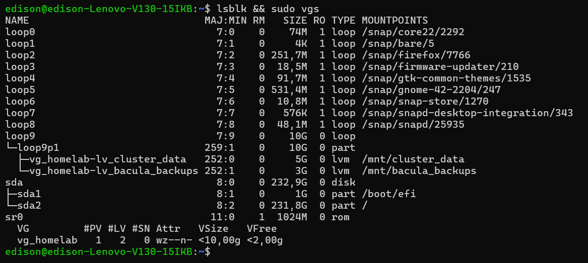
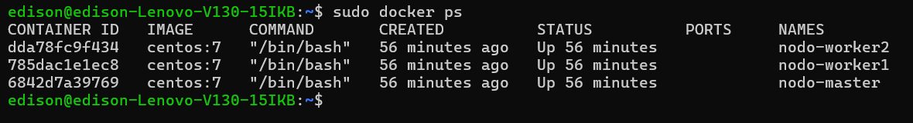
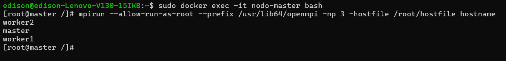
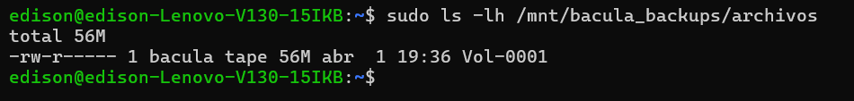

# Simulación de Clúster HPC con Docker, LVM y Bacula / HPC Cluster Simulation

**Languages:** [🇪🇸 Español](#-español) | [🇬🇧 English](#-english)

---

## 🇪🇸 Español

Este proyecto es una simulación de un entorno empresarial de Alto Rendimiento (HPC) y Alta Disponibilidad desplegado en un único host (Ubuntu 24.04). Su objetivo es demostrar competencias avanzadas en administración de sistemas Linux, virtualización ligera, redes aisladas y políticas de respaldo empresarial.

### Stack Tecnológico
* **Sistema Operativo Base:** Ubuntu 24.04 LTS
* **Contenedores:** Docker Engine (Nodos basados en CentOS 7)
* **Almacenamiento:** Gestión de Volúmenes Lógicos (LVM), Particionamiento GPT.
* **Computación Paralela:** OpenMPI, SSH Passwordless.
* **Backups:** Bacula (Director, Storage Daemon, File Daemon).
* **Automatización:** Bash Scripting, Systemd Services.

### Arquitectura del Proyecto

El entorno se divide en 4 fases principales que operan en conjunto:

#### 1. Gestión Avanzada de Almacenamiento (LVM)
Se aprovisionó un disco virtual (Loop device) de 10GB simulando almacenamiento en bloque (Block Storage). Sobre él, se creó un *Volume Group* (VG) y múltiples *Logical Volumes* (LV) formateados en `ext4` para separar los datos del clúster de las copias de seguridad. El montaje se automatizó mediante la creación de un servicio en **Systemd** (`homelab-storage.service`).

#### 2. Clúster Computacional Ligero (Docker & CentOS)
Para simular un clúster sin saturar los recursos del host (procesador i5), se desplegaron 3 contenedores Docker (1 Master, 2 Workers) conectados mediante una red virtual privada. Se realizó *Troubleshooting* en los repositorios de CentOS 7, migrando las rutas al *CentOS Vault* mediante automatización con Bash.

#### 3. Computación de Alto Rendimiento (OpenMPI)
Se configuró acceso **SSH Passwordless** entre el nodo Maestro y los nodos Trabajadores mediante claves RSA generadas dinámicamente. Posteriormente, se instaló la librería **OpenMPI** y se configuró un `hostfile` para procesar tareas en paralelo simultáneamente en los 3 nodos.

#### 4. Respaldo Empresarial Centralizado (Bacula)
Para garantizar la integridad del entorno, se instaló la suite de **Bacula**. Se configuró el *Storage Daemon* para apuntar directamente al volumen LVM creado en la Fase 1. Se ejecutaron trabajos (*Jobs*) de respaldo completos, verificando la creación de volúmenes virtuales (cintas magnéticas) en el disco.

###  Conclusión y Aplicabilidad
Este laboratorio demuestra mi capacidad para integrar múltiples tecnologías de infraestructura en un entorno funcional, automatizar tareas repetitivas mediante Bash/Systemd, resolver problemas de dependencias obsoletas (Vault) y gestionar el almacenamiento de forma escalable. Es una base sólida para administrar sistemas en entornos de producción reales.

---

## 🇬🇧 English

This project is a simulation of an enterprise High-Performance Computing (HPC) and High-Availability environment deployed on a single host (Ubuntu 24.04). Its objective is to demonstrate advanced competencies in Linux systems administration, lightweight virtualization, isolated networking, and enterprise backup policies.

###  Tech Stack
* **Base OS:** Ubuntu 24.04 LTS
* **Containers:** Docker Engine (CentOS 7 based nodes)
* **Storage:** Logical Volume Management (LVM), GPT Partitioning.
* **Parallel Computing:** OpenMPI, Passwordless SSH.
* **Backups:** Bacula (Director, Storage Daemon, File Daemon).
* **Automation:** Bash Scripting, Systemd Services.

###  Project Architecture

The environment is divided into 4 core phases operating seamlessly together:

#### 1. Advanced Storage Management (LVM)
A 10GB virtual block device (Loop device) was provisioned to simulate raw storage. A Volume Group (VG) and multiple Logical Volumes (LV) formatted in `ext4` were created to isolate cluster data from backups. The mounting process was fully automated by writing a custom **Systemd** service (`homelab-storage.service`).

#### 2. Lightweight Compute Cluster (Docker & CentOS)
To simulate a cluster without overloading the host's resources (i5 processor), 3 Docker containers (1 Master, 2 Workers) were deployed and connected via an isolated virtual network. I performed troubleshooting on deprecated CentOS 7 repositories, migrating the package manager endpoints to the *CentOS Vault* using Bash automation.

#### 3. High-Performance Computing (OpenMPI)
**Passwordless SSH** access was configured between the Master node and the Worker nodes using dynamically generated RSA keys. Subsequently, the **OpenMPI** library was installed and a `hostfile` was configured to distribute and process parallel tasks across the nodes.

#### 4. Centralized Enterprise Backup (Bacula)
To ensure environment integrity, the **Bacula** suite was deployed. The *Storage Daemon* was configured to point directly to the LVM volume created in Phase 1. Full backup Jobs were successfully executed, verifying the creation of virtual backup volumes (magnetic tapes) on the disk.

###  Conclusion & Applicability
This lab demonstrates my ability to integrate multiple infrastructure technologies into a functional environment, automate repetitive tasks using Bash/Systemd, troubleshoot legacy dependencies (Vault), and manage scalable storage. It serves as a solid foundation for systems administration in real-world production environments.
